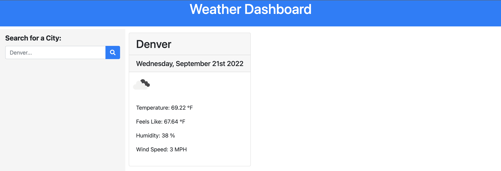
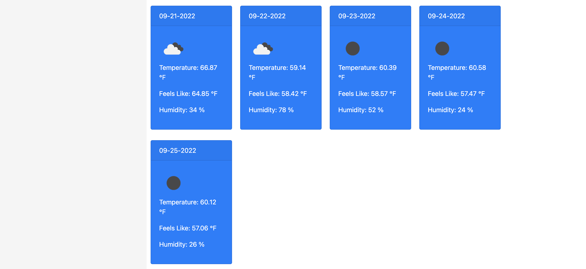

# Weather Dashboard

# Description:

A web application that shows the 5 day weather forecast for the preferred location. The application shows the wind speed, temperature etc.

# Links to :
# Github Repository:
<a href="https://github.com/vinitapp/WeatherDashboard.git">GitHub Repo</a>

# Deployed Website Link:
<a href="https://vinitapp.github.io/WeatherDashboard/">Deployed link</a>

# Screenshots

